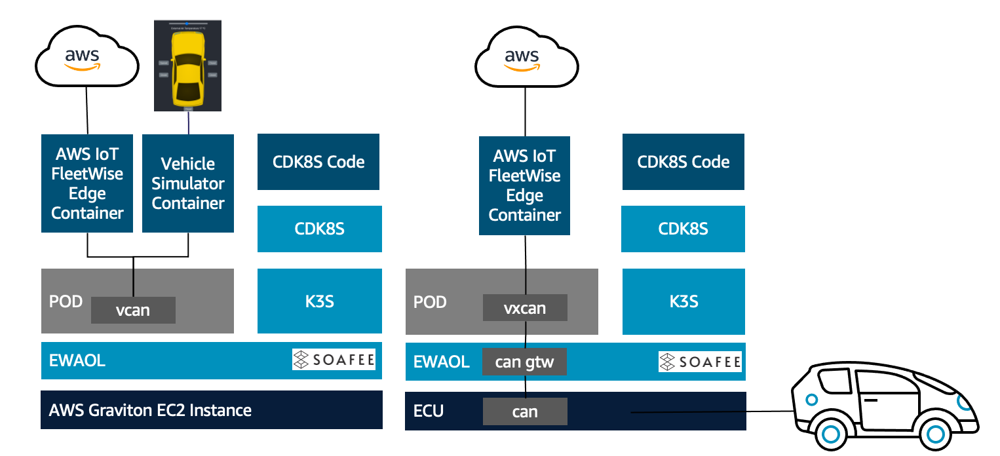

> :warning: THE CONTENT ON THIS REPO IS UNDER CONSTRUCTION !!!

# Welcome to the SOAFEE AWS IoT Fleetwise demo

The repository contains the instructions and code that allows you to reproduce the demo shown in the session [**Achieving environmental parity through multiple layers of abstractions helps to support AWS IoT FleeWise edge on EWAOL**](https://www.youtube.com/watch?v=Wd1isAmTtp8) at [SOAFEE Virtual Symposium 2022](https://soafee.io/blog/2022/virtual_symposium/).

The demo will walk you through the exercise of running on [EWAOL](https://github.com/aws4embeddedlinux/meta-aws-ewaol) the [AWS IoT FleeWise](https://aws.amazon.com/iot-fleetwise/) Edge. The [AWS IoT FleeWise Edge](https://github.com/aws/aws-iot-fleetwise-edge) will run in a container and the orchestration will be done with [k3s](https://k3s.io/). We can use the exact same container image both in the cloud and on a physical target, as long as they are based on an ARM v8 core. We also show how the [cdk8s](https://cdk8s.io/) framework can improve the software development process abstracting the orchestration layer.



## Getting started

Deploy Cloud 9 in one of the supported regions

[](https://external.ink?to=https://us-east-1.console.aws.amazon.com/cloudformation/home?region=us-east-1#/stacks/create/review?stackName=demo-soafee-aws-iotfleetwise-cloud9&templateURL=https://demo-soafee-aws-iot-fleetwise-us-east-1.s3.us-east-1.amazonaws.com/cloud9-env.template.json)

[](https://eu-central-1.console.aws.amazon.com/cloudformation/home?region=eu-central-1#/stacks/create/review?stackName=demo-soafee-aws-iotfleetwise-cloud9&templateURL=https://demo-soafee-aws-iot-fleetwise-eu-central-1.s3.eu-central-1.amazonaws.com/cloud9-env.template.json)

Acknoledge the creation of the stack and press the button **CREATE** on the bottom right. Wait for the two stacks to be created.

[Open Cloud9](https://console.aws.amazon.com/cloud9/home#) and, in a terminal, run the following script to create the cdk stack that will deploy all the cloud resources as shown on the architecture above

```sh
git clone https://github.com/aws-samples/demo-soafee-aws-iotfleetwise.git
cd ~/environment/demo-soafee-aws-iotfleetwise
./scripts/resize-c9.sh 20
./scripts/deploy-cloud.sh
```

### Get AWS FleetWise Edge running on the Build Host

This is the quickest option to see AWS IoT FleetWise running without having to build the EWAOL AMI, as detailed in the next paragraph.

We will be using the same orchestrator (k3s) used in EWAOL, so let's get started by installing it

```sh
curl -sfL https://get.k3s.io | sh -
sudo ln -s /usr/local/bin/kubectl /usr/bin/kubectl
```

Build the Vehicle Simulator container image that will feeding signals on the CAN Bus Data where the AWS IoT FleetWise Edge is listening on

```sh
sudo ./scripts/build-vsim.sh
```

Load certificate and private key for the vehicle into k3s secrets. These have been created by ```./scripts/deploy-cloud.sh``` above

```sh
sudo /usr/local/bin/kubectl create secret generic private-key --from-file=./.tmp/private-key.key
sudo /usr/local/bin/kubectl create secret generic certificate --from-file=./.tmp/certificate.pem
```

Deploy the kubernetes manifest to k3s

```sh
./scripts/deploy-k3s.sh
```

Now you can connect to the Vehicle Simulator Webapp opening the Cloud9 preview


You can try changing things such as opening/closing the vehicle doors and observe how the data signals values are fed into our Amazon Timestream table. You can either use [Amazon Timestream console](https://console.aws.amazon.com/timestream/home?#query-editor:) to run the query or you can paste the command below in one of the Cloud9 terminals.

```sh
aws timestream-query query --query-string \
  "SELECT * FROM FleetWise.FleetWise WHERE time > ago(5m) ORDER BY time DESC LIMIT 3" \
  | jq -r '.Rows[].Data[].ScalarValue'
```

### Get AWS FleetWise Edge running on an EWAOL Virtual Target 

TODO

### Get AWS FleetWise Edge running on an EWAOL Physical Target 

TODO

### Cleanup

TODO

---

This repository depends on and may incorporate or retrieve a number of third-party
software packages (such as open source packages) at install-time or build-time
or run-time ("External Dependencies"). The External Dependencies are subject to
license terms that you must accept in order to use this package. If you do not
accept all of the applicable license terms, you should not use this package. We
recommend that you consult your company’s open source approval policy before
proceeding.

Provided below is a list of External Dependencies and the applicable license
identification as indicated by the documentation associated with the External
Dependencies as of Amazon's most recent review.

THIS INFORMATION IS PROVIDED FOR CONVENIENCE ONLY. AMAZON DOES NOT PROMISE THAT
THE LIST OR THE APPLICABLE TERMS AND CONDITIONS ARE COMPLETE, ACCURATE, OR
UP-TO-DATE, AND AMAZON WILL HAVE NO LIABILITY FOR ANY INACCURACIES. YOU SHOULD
CONSULT THE DOWNLOAD SITES FOR THE EXTERNAL DEPENDENCIES FOR THE MOST COMPLETE
AND UP-TO-DATE LICENSING INFORMATION.

YOUR USE OF THE EXTERNAL DEPENDENCIES IS AT YOUR SOLE RISK. IN NO EVENT WILL
AMAZON BE LIABLE FOR ANY DAMAGES, INCLUDING WITHOUT LIMITATION ANY DIRECT,
INDIRECT, CONSEQUENTIAL, SPECIAL, INCIDENTAL, OR PUNITIVE DAMAGES (INCLUDING
FOR ANY LOSS OF GOODWILL, BUSINESS INTERRUPTION, LOST PROFITS OR DATA, OR
COMPUTER FAILURE OR MALFUNCTION) ARISING FROM OR RELATING TO THE EXTERNAL
DEPENDENCIES, HOWEVER CAUSED AND REGARDLESS OF THE THEORY OF LIABILITY, EVEN
IF AMAZON HAS BEEN ADVISED OF THE POSSIBILITY OF SUCH DAMAGES. THESE LIMITATIONS
AND DISCLAIMERS APPLY EXCEPT TO THE EXTENT PROHIBITED BY APPLICABLE LAW.


vsim/Dockerfile depends on third party **docker/library/node** container image, please refer to [license section](https://gallery.ecr.aws/docker/library/node) 

vsim/Dockerfile depends on third party **docker/library/python** container image, please refer to [license section](https://gallery.ecr.aws/docker/library/python) 